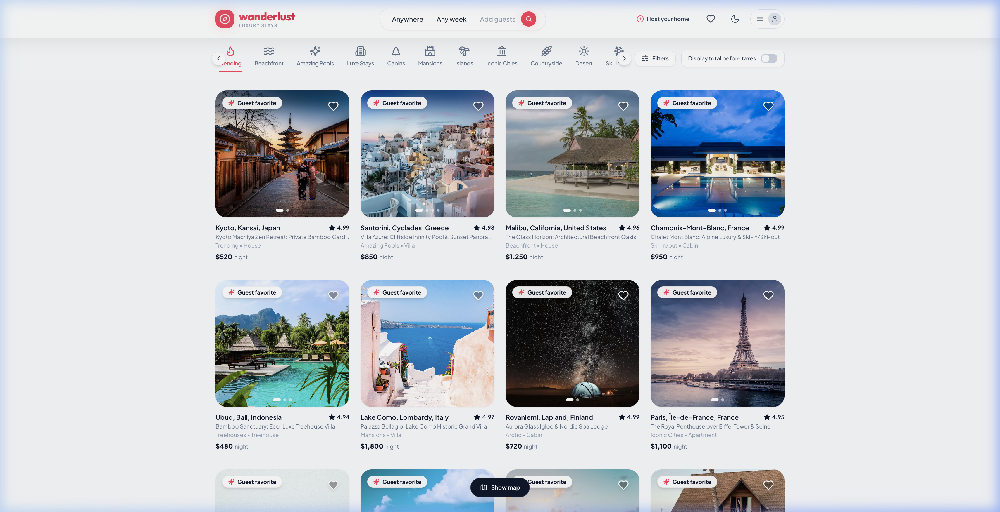
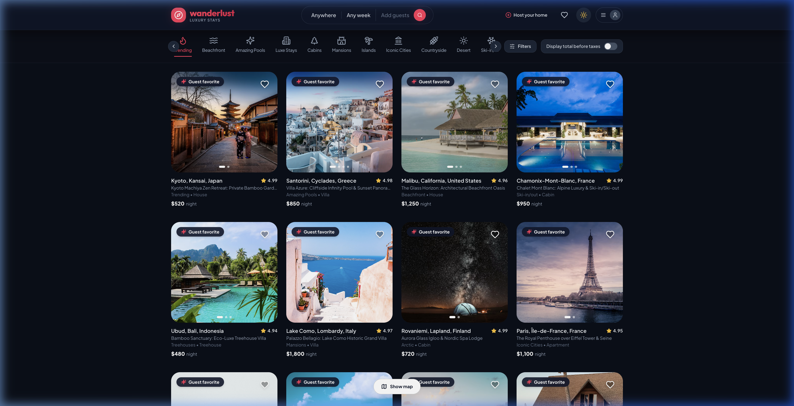
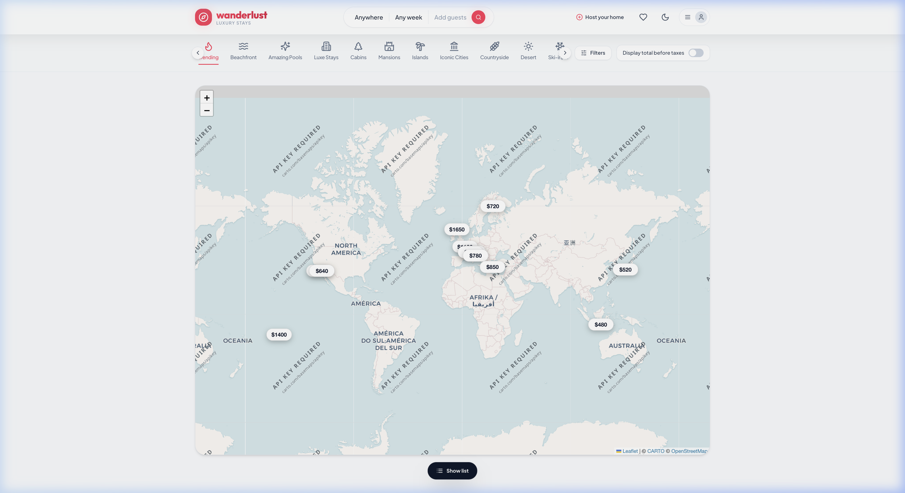
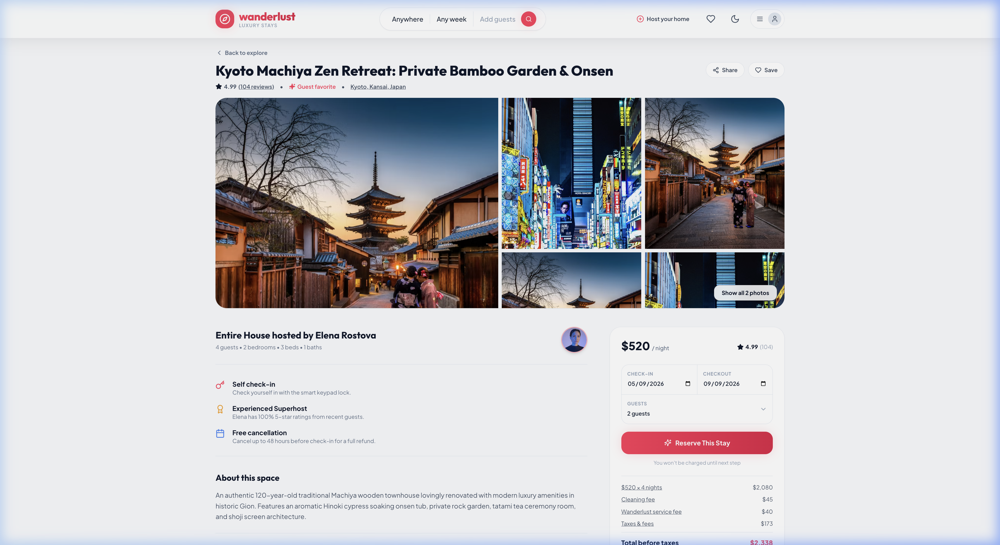
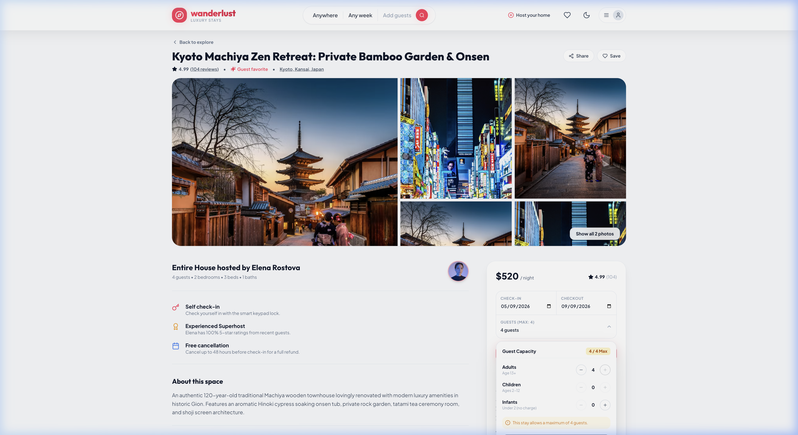
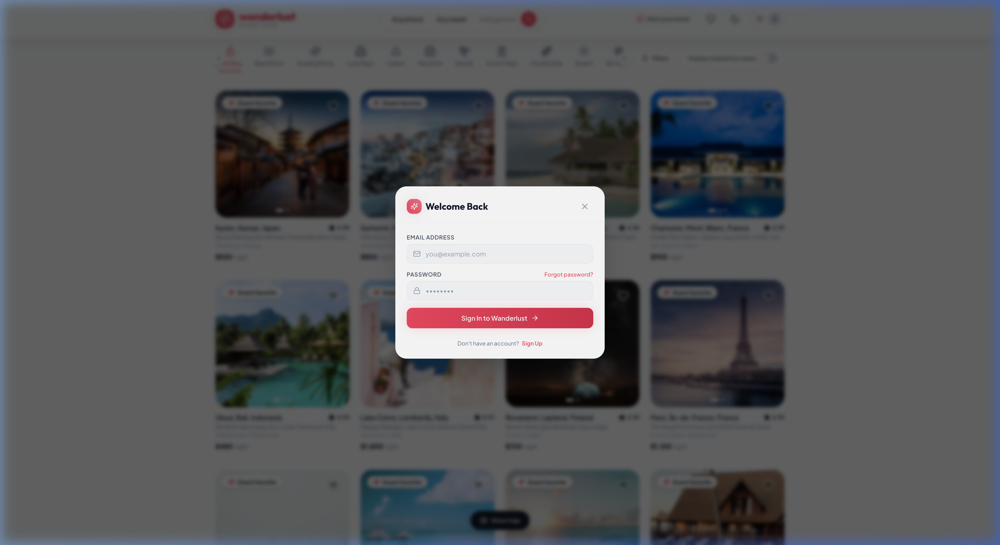

<div align="center">

# 🏰 LuxNest — Luxury Vacation Rentals & Unique Stays

<p align="center">
  <strong>A modern, full-stack luxury Airbnb clone built with React 18, Vite, Tailwind CSS, Node.js Express REST API, MongoDB, and Supabase Auth.</strong>
</p>

[](https://reactjs.org/)
[](https://vitejs.dev/)
[](https://tailwindcss.com/)
[](https://nodejs.org/)
[](https://expressjs.com/)
[](https://www.mongodb.com/)
[](https://supabase.com/)
[](https://www.docker.com/)

</div>

---

## 📸 Screenshots & Previews

### 🌟 1. Explore & Luxury Stays Catalog
> Discover curated villas, beachfront estates, cabins, and trending vacation getaways worldwide.
<div align="center">
  
</div>

---

### 🌙 2. Obsidian Dark Mode & Rich Glassmorphism
> Seamlessly toggle between light and dark modes with high-contrast luxury UI tokens.
<div align="center">
  
</div>

---

### 🗺️ 3. Interactive Leaflet Map View
> Explore properties with interactive OpenStreetMap geospatial markers and instant price tags.
<div align="center">
  
</div>

---

### 🏡 4. Signature 5-Photo Gallery & Stay Details
> Full property specifications, verified host profiles, amenities grid, and guest review systems.
<div align="center">
  
</div>

---

### 📅 5. Smart Booking Widget with Conflict Detection
> Dynamic date selector with automated conflict detection, guest capacity caps, and confetti checkout.
<div align="center">
  
</div>

---

### 🔐 6. Supabase Email Authentication
> Secure email & password auth with verification banners and interactive password visibility eye toggles.
<div align="center">
  
</div>

---

## ✨ Key Features

- 🎨 **Luxury Airbnb Design System**: Glassmorphism, smooth micro-interactions, responsive grids, and Obsidian dark mode.
- 🔐 **Supabase Authentication**: Email & password authentication with verification notices and show/hide password toggle.
- 🗺️ **Interactive Maps**: Real-time Leaflet / OpenStreetMap integration with custom price bubble markers.
- 📆 **Smart Booking Engine**: Live calendar availability, duplicate booking conflict prevention, and capacity enforcement.
- 👑 **Host Control Center**: Dual-tab dashboard for hosts to manage published listings, view incoming guest reservations, and calculate payouts.
- 💖 **Wishlist & Saved Stays**: Quick-save stays with persistent local and cloud storage synchronization.
- ⭐ **Reviews & Rating Aggregation**: Verified guest reviews with automatic rating recalculation.
- 🐳 **Docker Containerization**: Multi-stage production `Dockerfile` and `docker-compose.yml` for 1-command deployment.

---

## 🛠️ Technology Stack

| Layer | Technologies |
|---|---|
| **Frontend SPA** | React 18, Vite 6, Tailwind CSS, Framer Motion, Lucide Icons, Canvas Confetti |
| **Mapping** | Leaflet, React-Leaflet, OpenStreetMap / CartoDB Voyager & Dark Tiles |
| **Authentication** | Supabase Auth (JWT Bearer Token verification on backend) |
| **Backend REST API** | Node.js 22, Express 4, Mongoose ODM, Multer, Cloudinary SDK |
| **Database** | MongoDB 7.0 (Local / Mongo Atlas) |
| **DevOps & Containers** | Docker, Docker Compose, Nginx Alpine |

---

## 🚀 Getting Started

### Prerequisites
- [Node.js](https://nodejs.org/) (v20 or v22 LTS)
- [MongoDB](https://www.mongodb.com/) (running locally or a MongoDB Atlas URI)
- (Optional) [Docker Desktop](https://www.docker.com/)

---

### 📦 Option 1: Local Development

#### 1. Clone the repository
```bash
git clone https://github.com/BinaryBlaze16/LuxNest-Air-BnB.git
cd LuxNest-Air-BnB
```

#### 2. Configure Backend Environment
```bash
cp server/.env.example server/.env
```
Edit `server/.env` with your MongoDB URI, Supabase credentials, and Cloudinary keys:
```env
PORT=5050
NODE_ENV=development
LOCAL_MONGODB_URI=mongodb://127.0.0.1:27017/luxnest
MONGODB_URI=mongodb://127.0.0.1:27017/luxnest
SUPABASE_URL=https://your-project.supabase.co
SUPABASE_PUBLISHABLE_KEY=your_publishable_key
SUPABASE_SECRET_KEY=your_secret_key
CLOUD_NAME=your_cloudinary_name
CLOUD_API_KEY=your_cloudinary_key
CLOUD_API_SECRET=your_cloudinary_secret
CLIENT_URL=http://localhost:5173
```

#### 3. Start Backend Server
```bash
cd server
npm install
npm run seed     # Seeds 12 initial luxury stays
node server.js   # Starts API on http://localhost:5050
```

#### 4. Start Frontend Client (in a new terminal tab)
```bash
cd client
npm install
npm run dev      # Starts React app on http://localhost:5173
```

---

### 🐳 Option 2: Run with Docker Compose (Recommended)

To spin up MongoDB, Express REST API, and Nginx React client with a single command:

```bash
docker compose up --build
```

- **Frontend App**: [http://localhost:5173](http://localhost:5173)
- **REST API**: [http://localhost:5050/api](http://localhost:5050/api)
- **API Health Check**: [http://localhost:5050/api/health](http://localhost:5050/api/health)
- **MongoDB**: `localhost:27017`

---

## 📂 Project Structure

```
LuxNest-Air-BnB/
├── client/                     # React 18 + Vite SPA Frontend
│   ├── src/
│   │   ├── components/         # Navbar, Footer, BookingWidget, AuthModal, MapView...
│   │   ├── context/            # AuthContext, ThemeContext, WishlistContext
│   │   ├── pages/              # Home, ListingDetails, MyListings, Bookings, Wishlist...
│   │   ├── api.js              # Axios instance with Supabase JWT interceptor
│   │   └── supabase.js         # Supabase client setup
│   ├── nginx.conf              # Production Nginx configuration
│   └── Dockerfile              # Frontend container image
├── server/                     # Node.js + Express REST API
│   ├── config/                 # db.js, cloudinary.js, supabase.js
│   ├── controllers/            # listingController, bookingController, reviewController...
│   ├── middleware/             # auth.js (JWT validation & Mongo user sync)
│   ├── models/                 # Listing, Booking, User, Review schemas
│   ├── routes/                 # listings, bookings, reviews, users, seed
│   ├── scripts/                # seed.js (12 curated luxury stays)
│   ├── server.js               # Express application entrypoint
│   └── Dockerfile              # Backend container image
├── docs/
│   └── screenshots/            # UI screenshots
├── docker-compose.yml          # Multi-container orchestration (Mongo, Server, Client)
├── Dockerfile                  # Unified production full-stack image
├── DOCKER.md                   # Complete containerization documentation
└── README.md                   # Project documentation
```

---

## 📄 License

This project is open source and available under the [MIT License](LICENSE).
